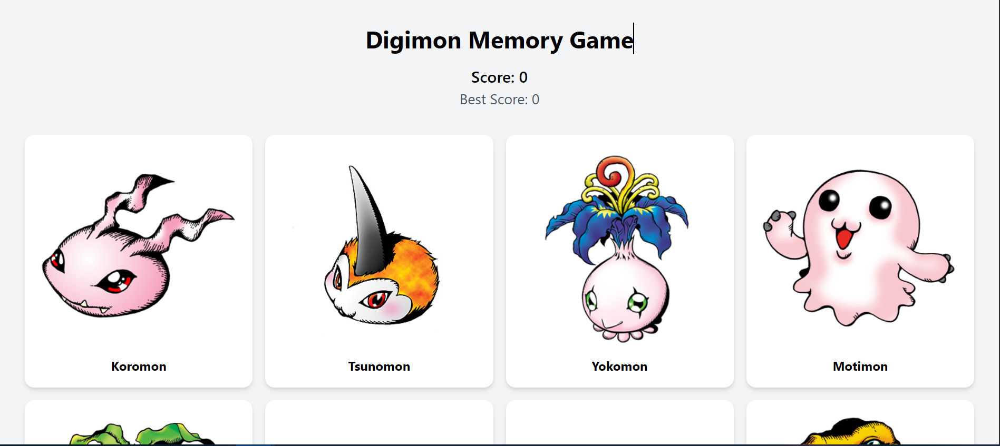

# Digimon Memory Game 👾


[Visit Live Demo](LINK_DEMO_KAMU_DI_SINI)

A fun and interactive memory card game built with **React** and **Tailwind CSS**. The goal is simple: click every Digimon card exactly once. If you click the same card twice, your score resets!

## 🚀 Features
* **Dynamic Data**: Fetches real-time Digimon data from the [Digimon API](https://digimon-api.vercel.app/).
* **Shuffle Logic**: Implements the **Fisher-Yates Shuffle Algorithm** to randomize card positions after every click.
* **Score Tracking**: Displays your current score and persists your **Best Score** during the session.
* **Responsive UI**: Styled with Tailwind CSS for a modern and mobile-friendly experience.
* **Win Condition**: A "Congratulations" message and a "Play Again" button appear when you successfully click all cards.

## 🛠️ Tech Stack
* **Frontend**: React.js ⚛️
* **Styling**: Tailwind CSS 🎨
* **State Management**: React Hooks (`useState`, `useEffect`) 🧠
* **API**: [Digimon API](https://digimon-api.vercel.app/) 🦖

## 📸 Preview
 
*(Ganti link ini dengan screenshot game kamu setelah di-deploy)*

## 🏁 Getting Started

1.  **Clone the repository**
    ```bash
    git clone [https://github.com/USERNAME/REPO_NAME.git](https://github.com/USERNAME/REPO_NAME.git)
    ```
2.  **Install dependencies**
    ```bash
    npm install
    ```
3.  **Run the application**
    ```bash
    npm run dev
    ```

## 🧠 Lessons Learned
In this project, I deepened my understanding of:
* Managing complex states in React, including functional updates.
* Handling asynchronous API calls with `useEffect`.
* Implementing algorithmic logic (Shuffling) within a UI framework.
* Applying clean code principles through **Component Decomposition**.

---